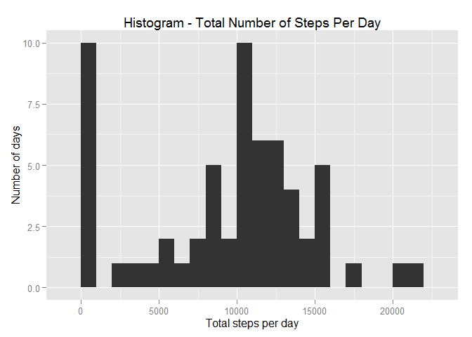
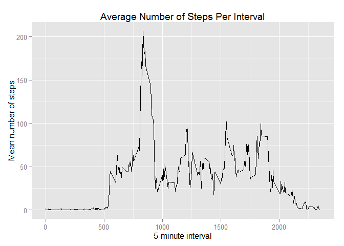
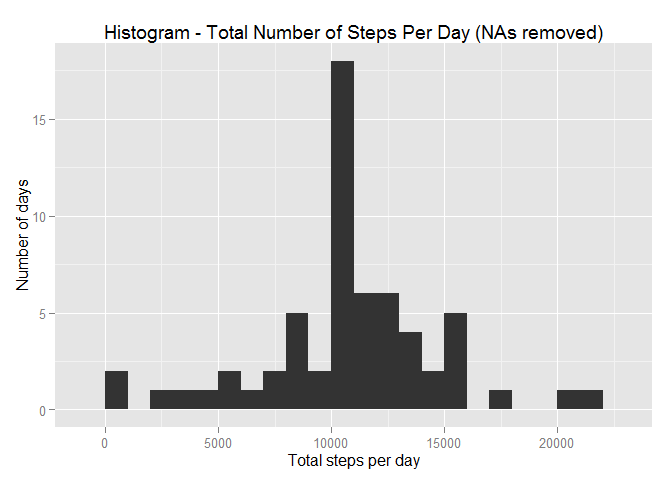
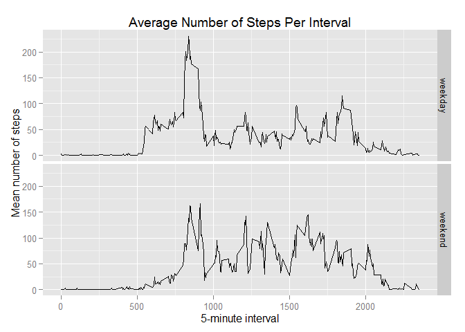

# Reproducible Research: Peer Assessment 1

The goal of this assignment is to report on the level of physical activity of an anonymous subject as measured by the number of steps taken throughout the day.  

The data come from a personal activity monitoring device. This device collects data at 5 minute intervals through out the day. The data consists of two months of data from an anonymous individual collected during the months of October and November, 2012 and include the number of steps taken in 5 minute intervals each day.  

The report compares the activity pattern obtained when neglecting missing values to the one obtained after imputation of the missing values.  Also, it compares weekdays to weekends activity levels of the observed subject.


## Loading and preprocessing the data

The data file *activity.csv* is loaded and stored in data frame **act**.  


```r
act <- read.csv("activity.csv")
str(act)
```

```
## 'data.frame':	17568 obs. of  3 variables:
##  $ steps   : int  NA NA NA NA NA NA NA NA NA NA ...
##  $ date    : Factor w/ 61 levels "2012-10-01","2012-10-02",..: 1 1 1 1 1 1 1 1 1 1 ...
##  $ interval: int  0 5 10 15 20 25 30 35 40 45 ...
```

## What is mean total number of steps taken per day?

Let's first calculate the total number of steps taken per day and plot a histogram.  


```r
library(dplyr)
```

```
## 
## Attaching package: 'dplyr'
## 
## The following objects are masked from 'package:stats':
## 
##     filter, lag
## 
## The following objects are masked from 'package:base':
## 
##     intersect, setdiff, setequal, union
```

```r
library(ggplot2)
total_by_grp <- summarize(group_by(act, date), total = sum(steps, na.rm = TRUE))
qplot(total, data = total_by_grp, binwidth = 1000, xlab = "Total steps per day",
      ylab = "Number of days", main = "Histogram - Total Number of Steps Per Day")
```

 
The mean and median values of the total number of steps taken per day are calculated as follows.  Take note that the missing values are disregarded in both calculations.  


```r
mean(total_by_grp$total, na.rm = TRUE)
```

```
## [1] 9354.23
```

```r
median(total_by_grp$total, na.rm = TRUE)
```

```
## [1] 10395
```


## What is the average daily activity pattern?

In order to show the daily activity pattern, we produce a time series plot of the 5-minute intervals and the average number of steps taken, averaged across all days.  


```r
# Daily activity pattern
# First, calculate mean number of steps taken per 5-minute interval
act1 <- summarize(group_by(act, interval), avg = mean(steps, na.rm = TRUE))
# Plot the time series
qplot(interval, avg, data = act1, geom = "line", xlab = "5-minute interval",
      ylab = "Mean number of steps", main = "Average Number of Steps Per Interval")
```

 
The code below determines the 5-minute interval that contains the maximum number of steps.  


```r
act1[which(act1$avg == max(act1$avg)), 1]
```

```
## Source: local data frame [1 x 1]
## 
##   interval
## 1      835
```
The number identifying the 5-minute interval has been encoded such that it can be interpreted as the time of day at which the interval begins.  Therefore the interval 835 corresponds to 8:35 AM.

## Imputing missing values

The total number of missing values which is 2304 is calculated using this code.     


```r
# How many values are missing?
sum(is.na(act$steps))
```

```
## [1] 2304
```

This total represents 13.11 percent of the total number of observations.  In order to alleviate the biases that might be introduced in calculations by the presence of missing values we will replace a missing value by the mean number of steps of its 5-minute interval calculated across all days in the data frame.  


```r
# Add average steps per interval to data frame act and create new data frame 
# act_no_na in which missing values will be replaced with the average number of steps
# calculated for their interval
act_no_na <- left_join(act, act1, by = "interval")
# Replace missing values in steps with average values of steps averaged over 
# all intervals across all days in the data frame 
idx <- which(is.na(act_no_na$steps))
act_no_na$steps[idx] <- act_no_na$avg[idx]
```

The histogram of the total number of steps per day drawn below can be compared to the histogram presented above that did not consider missing values. While the two histograms share a similar shape, the number of occurrences of values between 0 and 1 000 is drastically less in the latest histogram.  


```r
# Calculate total number of steps per day and store summary result in data frame 
# total_by_grp1
total_by_grp1 <- summarize(group_by(act_no_na, date), total = sum(steps))
# Plot histogram of total number of steps per day
qplot(total, data = total_by_grp1, binwidth = 1000, xlab = "Total steps per day",
      ylab = "Number of days", 
      main = "Histogram - Total Number of Steps Per Day (NAs removed)")
```

 

The mean and median of the total number of steps taken per day are given below.  As can be seen, the replacement of the missing values has tightened up the distibution of values and made it more symmetric (the mean is equal to the median).  


```r
# Mean and median
mean(total_by_grp1$total)
```

```
## [1] 10766.19
```

```r
median(total_by_grp1$total)
```

```
## [1] 10766.19
```

## Are there differences in activity patterns between weekdays and weekends?

In order to compare activity patterns between weekdays and weekends we must first create another factor variable that accounts for division of dates between weekdays and weekends.  The code below takes care of that task.


```r
# Define new factor variable for weekdays and weekends
act_no_na$date <- as.Date(as.character(act_no_na$date))
act_no_na$period <- ifelse(weekdays(act_no_na$date) %in% c("samedi", "dimanche"),
                           "weekend", "weekday")
act_no_na$period <- as.factor(act_no_na$period)
```
The panel plot shown below compares the subject weekdays and weekends activity patterns.  A first observation we can make on the two plots is that they have a similar shape with peeks being located on approximately the same intervals.  The subject is more active early in the morning on weekdays (between 5:00 AM and 10:00 AM) while he generally more active between 10:00 AM and 8:00 PM during weekends.  That behaviour could indicate that the subject is an office worker (rather sedentary during his work hours) who is fairly active during weekends.  


```r
# total_by_grp2 contains the mean number of steps per interval and period
total_by_grp2 <- summarize(group_by(act_no_na, period, interval), avg = mean(steps))
# Panel plot of average number of steps time series comparing factor "weekdays" to
# factor "weekend"
qplot(interval, avg, data = total_by_grp2, geom = "line", facets = period ~ .,
      xlab = "5-minute interval", ylab = "Mean number of steps",
      main = "Average Number of Steps Per Interval")
```

 

